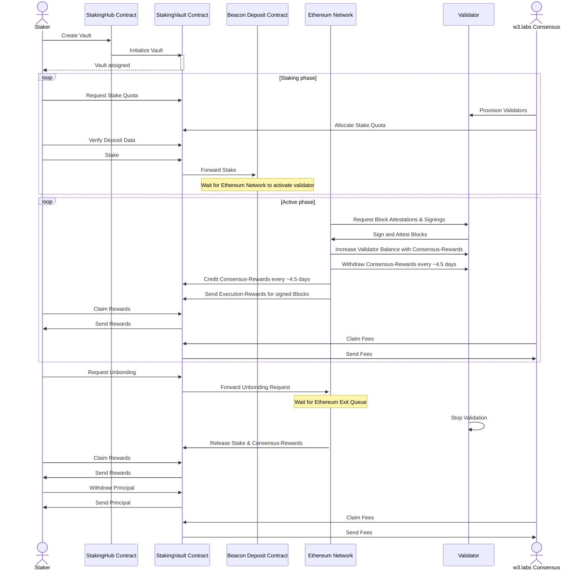

# w3.labs Staking Contracts

This repository contains the smart contract code for the w3.labs staking platform.
Contracts are organized in the [`src`](/src) directory. [`lib`](/lib) contains external interfaces we depend on, managed via git submodules.
The [`tests`](/tests) and [`scripts](/scripts) directories contain tests and scripts respectively.

The following table lists the networks and respective addresses that the contracts have been deployed to:

| Network | Chain Id | Contract                      | Address |
| ------- | -------- | ----------------------------- | ------- |
| Mainnet | 1        | StakingHub                    | [0x]()  |
| Mainnet | 1        | StakingVault (Implementation) | [0x]()  |
| Holesky | 17000    | StakingHub                    | [0x]()  |
| Holesky | 17000    | StakingVault (Implementation) | [0x]()  |

## Contracts

### StakingHub

The w3.labs StakingHub contract acts as the central hub to creating instances of our StakingVault.
The notable interface exposed is the `createVault` function, which allows for the creation of a new StakingVault instance.
We instantiate StakingVaults by creating [`EIP-1967 proxies`](https://eips.ethereum.org/EIPS/eip-1967) pointing to the StakingVault Implementation, thereby following the [`EIP-1822 UUPS standard`](https://eips.ethereum.org/EIPS/eip-1822).

### StakingVault

The w3.labs StakingVault contract enables the deployment of multiple Ethereum validators at once.
The notable interactions with it are depicted in the following sequence diagram:



## Design Decisions

### UUPS

As noted above, we are implementing the UUPS standard. The StakingVault is initializable when instantiated via an EIP-1967 proxy. This allows the effective owner of a StakingVault to upgrade their instance of a StakingVault.

### Access Control

The StakingVault defined three roles: `staker`, `depositor`, and `operator`
The `staker` role is the primary role, allowing for:

- Upgrading the StakingVault
- Requesting stake quotas
- Requesting stake unbondings
- Withdraw principal after unbonding
- Claim rewards
- Add addresses to the `depositor` role
- Act as `depositor`

The `depositor` role is a secondary role, allowing for:

- Depositing, i.e., staking, funds into the StakingVault

The `operator` role is associated with the node operator, allowing for:

- Approving stake quotas, i.e., adding deposit data to the StakingVault
- Attest unbondings
- Claim fees
- Update the fee recipient address

### Expensive stake quota requests

Stake quota requests are purposefully expensive to prevent spamming our validator provisioning service.
The cost of a stake quota request is proportional to the number of validators requested.
We do this by preallocating storage slots for deposit data that is to be registered by the operator.

### Execution triggerable exits

We are implementing [EIP-7002](https://eips.ethereum.org/EIPS/eip-7002) to allow the `staker` to trigger unbondings of stake, i.e., exits of validators, solely via the execution layer. That is to fully enable the `staker` to manage their stake without the need for external interactions.

#### EIP-7002

EIP-7002 will become active with the upcoming [Pectra hardfork](https://eips.ethereum.org/EIPS/eip-7600). Up until then, the associated functions will revert.

The tests contain references to the compiles [geas](https://github.com/fjl/geas) implementation of EIP-7002, as found in:

- Original source: https://github.com/lightclient/sys-asm/blob/main/src/withdrawals/main.eas
- Taken from commit `e5d197005661481f7b83f189e183949eaa2d3ae5`
- The official audit references this repository: https://github.com/ethereum/requests-for-proposals/blob/master/open-rfps/pectra-system-contracts-audit.md
- Compiled with: `geas lib/sys-asm/src/withdrawals/main.eas`

### No support for EIP-7251

We are aware of [EIP-7251](https://eips.ethereum.org/EIPS/eip-7251), but this StakingVault implementation does explicitly use `0x01` withdrawal credentials only. We consider implementing a compounding version of this StakingVault using `0x02` credentials, but this is out of scope for this implementation.

Execution-layer triggerable validator consolidation are not an issue for our StakingVault as the StakingVault itself is set to be the withdrawal address and therefore the only entity that can trigger such consolidations.

### Not using EIP-4788

We are aware of [EIP-4788](https://eips.ethereum.org/EIPS/eip-4788), i.e., the effective presence of beacon chain data in the EVM but found little value for our concrete implementation compared to the complexity it poses to implement and the UX it imposes onto the caller. We have therefore decided not to implement any proofs and proof checking in the StakingVault. This comes with at least one limitation when calculating rewards, fees, and unbonded principal: In our design, withdrawable principal takes precedence. When an unbonding is triggered, rewards and fees present in the vault are temporarily "locked" by being allocated towards being withdrawn as principal. Once the principal is swept off the balance of the exited validator, fees and rewards can be claimed as usual.

## Setup

We are using foundry as the primary development toolkit for this project. Follow [the foundry documentation to set it up](https://book.getfoundry.sh/getting-started/installation). The following tools are used in this project:

- [Forge](https://github.com/foundry-rs/foundry): compile, test, fuzz, format, and deploy smart
  contracts
- [Forge Std](https://github.com/foundry-rs/forge-std): collection of helpful contracts and utilities for testing
- [Prettier](https://github.com/prettier/prettier): code formatter for non-Solidity files
- [Solhint](https://github.com/protofire/solhint): linter for Solidity code

For static analysis, [Slither](https://github.com/crytic/slither) is used to perform automated security analysis on the smart contracts.

```shell
python3.13 -m venv venv
source venv/bin/activate
pip3 install slither-analyzer
```

We use `solc-select` for managing the active solidity version.

```shell
pip3 install solc-select
solc-select install 0.8.28
solc-select use 0.8.28
```

## Developing

### Building

```shell
# forge clean
forge build
```

### Formatting

```shell
forge fmt
```

### Linting

```shell
npm run lint
```

### Static-Analysis

```shell
npm run analyze
```

### Testing

To run the tests, you can run:

```shell
npm run test
npm run test:gas-report
npm run test:coverage:report
```
